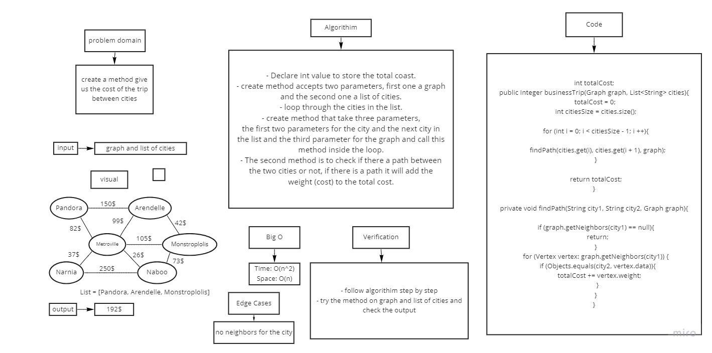
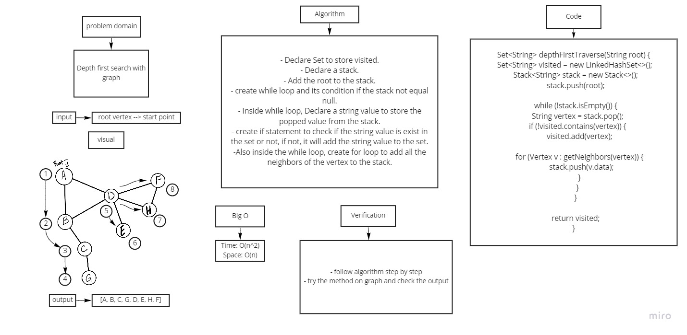

# Graphs
A Graph is a non-linear data structure consisting of nodes and edges.
The nodes are sometimes also referred to as vertices and the edges are lines or arcs that connect any two nodes in the graph.

## Challenge
Implementing Graph Data structure.

## Approach & Efficiency
Implemented the graph and held the nodes of it into a hash map with type T (Generic), and Another Hash map
of type T, Integer(For the weight).
## API
Class Graph :
- Member Variables:
  - Hash map nodes<T , <HashMap<T , Integer>>>
- Methods :
  - addNode(T node) : adds a node to the graph (no edges specified yet).
  - addEdge(T sourceNode , T destinationNode , int weight) : adds an edge between two nodes.
  - getNodes() : returns All nodes in a graph.
  - getNeighbours(T node) : returns all neighbours of a specific graph.
  - getSize() : returns the size of the graph.

# Graph Breadth First challenge 36

Create a static method which returns a Set of the Graph vertices in their breadth from a specified root.

## Challenge

Create a method that take a vertex as a parameter as a start point and return a collection of vertices in the order they were visited.

## Whiteboard Process

## Approach and Efficiency

* Time: O(n^2)

* Space: O(n)

# Graph Business Trip challenge 37

This challenge to check the weight of edge between the connected vertices.

## Challenge

Create a method give us the cost of the trip between cities.

## Whiteboard Process

## Approach and Efficiency

* Time: O(n^2)

* Space: O(n)

# Graph Depth First challenge 38

Create a static method which returns a Set of the Graph vertices in their Depth from a specified root.

## Challenge

Create a method that take a vertex as a parameter as a start point and return a collection of vertices in the order they were visited.

## Whiteboard Process

## Approach and Efficiency

* Time: O(n^2)

* Space: O(n)
