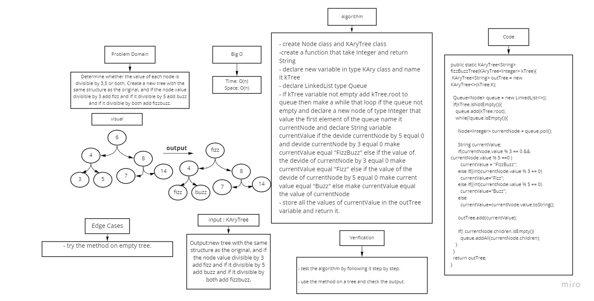

# Challenge Summary
Determine whether the value of each node is divisible by 3,5 or both. Create a new tree with the same structure as the original, and if the node value divisible by 3 add fizz and if it divisible by 5 add buzz and if it divisible by both add fizzbuzz.

## Whiteboard Process

## Approach & Efficiency
- Time: O(n)
- Space: O(n)

