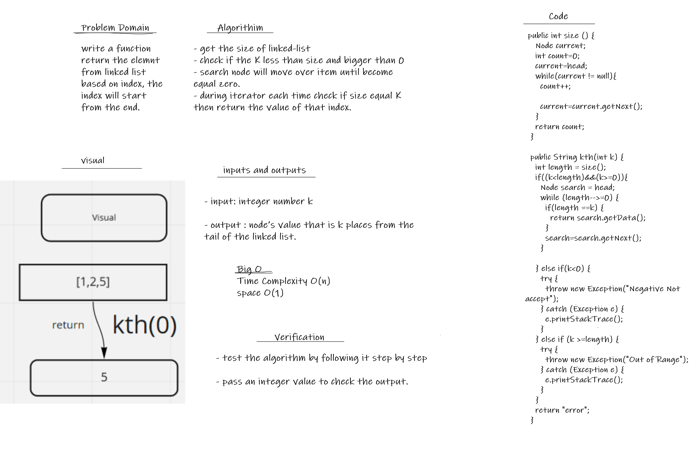
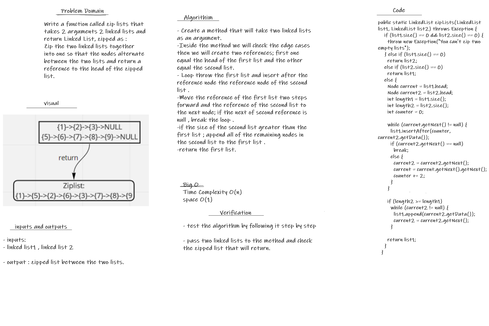

# Challenge
Write a function called zip lists that takes 2 arguments 2 linked lists and
return Linked List, zipped as :
Zip the two linked lists together into one so that the nodes alternate between the two lists and return a reference to the head of the zipped list.

## WhiteBoard:

## Approach & Efficiency

- Time Complexity O(n)
- space O(1)

