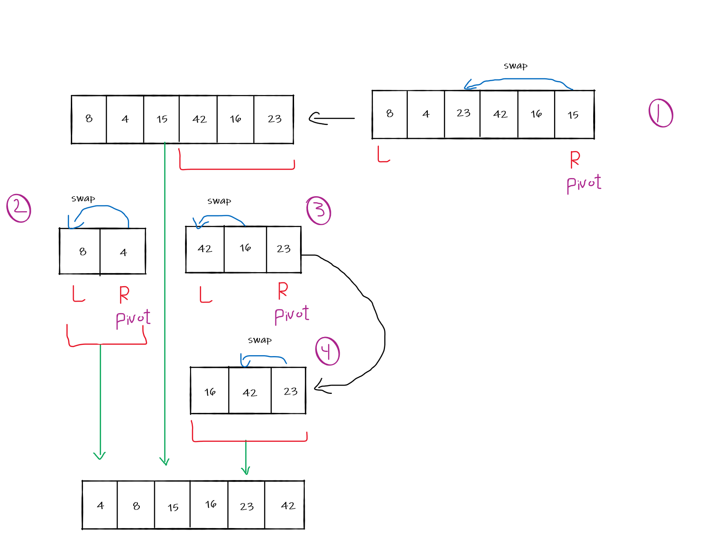

# Quick Sort

quicksort algorithm repeatedly divides an un-sorted section into a lower order sub-section and a higher order sub-section by comparing to a pivot element. At the end of recursion, we get sorted array.

## Pseudocode

```
ALGORITHM QuickSort(arr, left, right)
    if left < right
        DEFINE position <-- Partition(arr, left, right)
        QuickSort(arr, left, position - 1)
        QuickSort(arr, position + 1, right)

ALGORITHM Partition(arr, left, right)
    DEFINE pivot <-- arr[right]
    DEFINE low <-- left - 1
    for i <- left to right do
        if arr[i] <= pivot
            low++
            Swap(arr, i, low)

     Swap(arr, right, low + 1)
     return low + 1

ALGORITHM Swap(arr, i, low)
    DEFINE temp;
    temp <-- arr[i]
    arr[i] <-- arr[low]
    arr[low] <-- temp
```

## The Code

```
    public void quickSort(int[] arr, int left, int right){


        if(arr.length < 2)
            return;

        if(left < right){

            int position = partition(arr, left, right);
            quickSort(arr, left, position - 1);
            quickSort(arr, position + 1, right);
        }
    }

    public int partition(int[] arr, int left, int right){

        int pivot = arr[right];

        int low = left - 1;
        for(int i = left; i < right; i++){
            if ( arr[i] <= pivot){
                low ++;
                swap(arr, i, low);
            }
        }
        swap(arr, right, low + 1);
        return low + 1;
    }

    public void swap(int[] arr, int i, int low){
        int temp;
        temp = arr[i];
        arr[i] = arr[low];
        arr[low] = temp;
    }

```

## Trace

Example Array: [8, 4, 23, 42, 16, 15]


