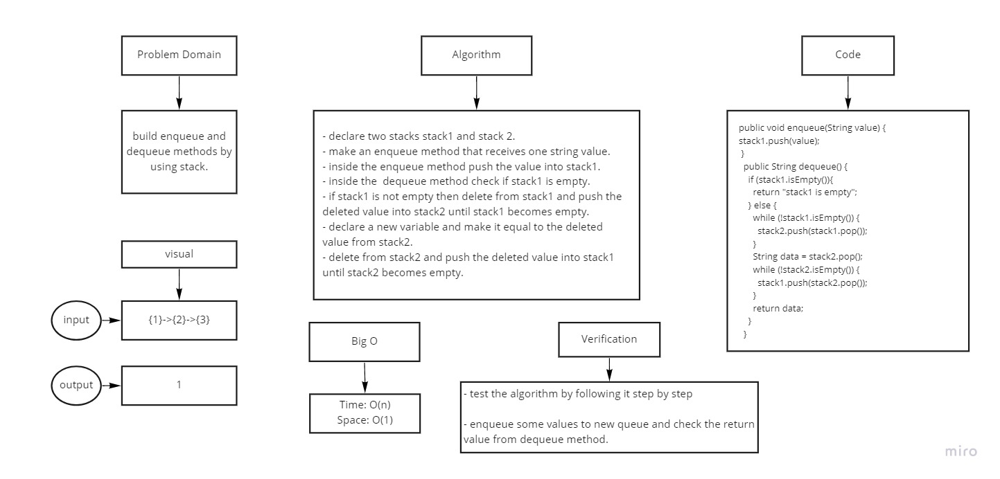
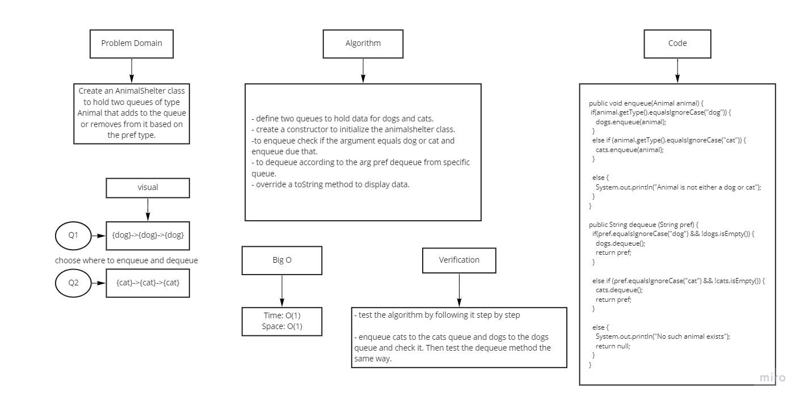
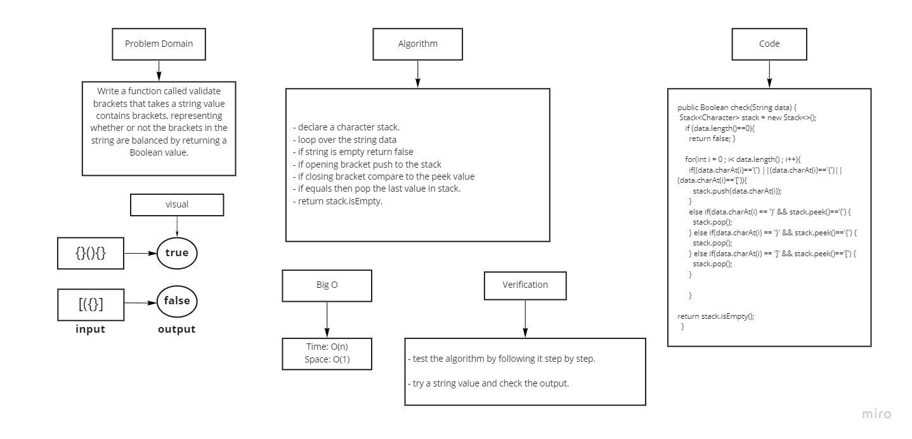

# Stacks and Queues

## Challenge 10
Using a Linked List as the underlying data storage mechanism, implement both a Stack and a Queue

## challenge 11
Implement a Queue using two Stacks

## Whiteboard Process for challenge 11

## challenge 12
Create an AnimalShelter class to hold two queues of type Animal that adds to the queue or removes from it based on the pref type.

## Whiteboard Process for challenge 12

## challenge 13
Write a function called validate brackets that takes a string value contains brackets, representing whether or not the brackets in the string are balanced by returning a Boolean value.

## Whiteboard Process for challenge 13

