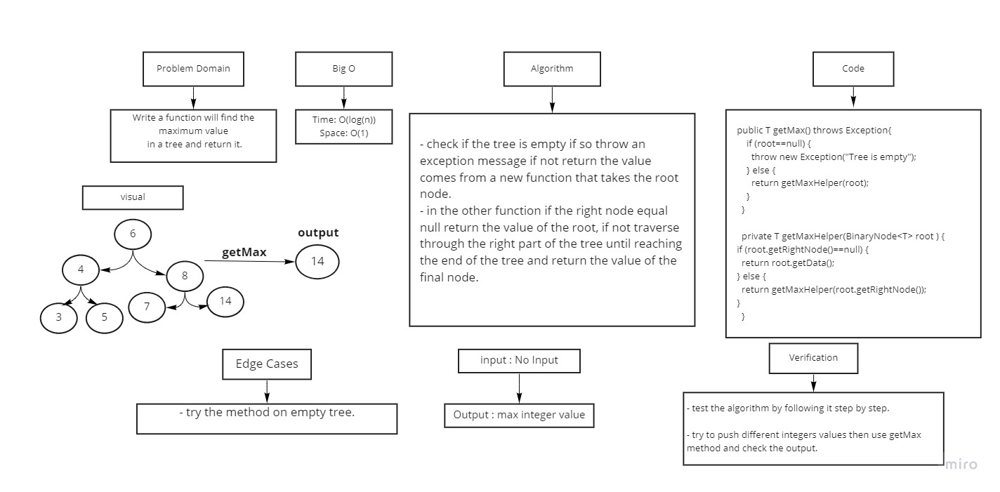

# Trees
Binary Tree and BST Implementation

## Challenge
Binary Search Tree
- create a Binary Search Tree class
- create Add methode adds a new node with a value in the correct location in the binary search tree.
- create Contains methode that takes a value and return boolean indicating whether or not the value is in the tree at least once.

## Challenge
Binary Search Tree
- create a Binary Search Tree class
- create Add methode adds a new node with a value in the correct location in the binary search tree.
- create Contains methode that takes a value and return boolean indicating whether or not the value is in the tree at least

## Approach & Efficiency
- Time complexity O(log(n))
- Space O(1)

# Challenge 16
Find the Maximum Value in a Binary search Tree

## Whiteboard Process

## Approach & Efficiency
- Time complexity O(log(n))
- Space O(1)

